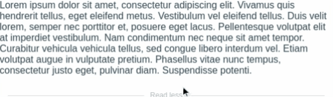

# vue-read-more-smooth

[](./LICENSE)
[](https://vuejs.org)
[](https://www.npmjs.com/package/vue-read-more-smooth)
[](https://www.npmjs.com/package/vue-read-more-smooth)


"Read more" button with animation and easy usage for vuejs.

## Install

Via [npm](https://www.npmjs.com/):

[](https://www.npmjs.com/package/vue-read-more-smooth)

```🚀sh
npm install vue-read-more-smooth --save
```
Via [Yarn](https://yarnpkg.com/):

```sh
yarn add vue-read-more-smooth
```

## Demo & examples



Code examples: https://dicren.github.io/vue-read-more-smooth/

## Usage

```jsx
<template>
  <VueReadMoreSmooth>
    <p>Lorem Ipsum</p>
  </VueReadMoreSmooth>
</template>
<script>
  import VueReadMoreSmooth from "vue-read-more-smooth";
  export default {
    name: "app",
    components: { VueReadMoreSmooth }
  }
</script>
```

## Properties

 |  Property  |  Type  |  Default  |  Description  | 
 |  -  |  :-:  |  :-:  |  -  | 
 |  :lines  | number | `3`  |  Number of lines to show before the read more button. | 
 |  :g-lines | number | `2` |  Shadow's size. If lines is greater than 12, g-lines default value is 4, if lines is greater than 6, g-lines default value is 3
 |  :max-lines | number | `lines + 1` |  If your text has less than max-lines, the container acts as a normal div.
 |  :text | string | `Read more` |  obvious
 |  :text-less | string | `Read less` |  obvious
 |  :no-less | boolean | `false` |  if true button disappear after click read more
 |  :open | boolean | `false` |  open and close programmatically. .sync is available.
 |  :no-button | boolean | `false` |  Hide the button. To use in combination with :open
 |  :no-shadow | boolean | `false` |  Hide the shadow.
 

## Changelog

### 0.1.8 - 2019-08-09
#### Added
- :open property
- :no-button property
- :no-shadow property
#### Removed
- :open-by-default property, replaced by :open

## License

[MIT](LICENSE)

---
⌨️ with ❤️ by [dicren](https://github.com/dicren)
